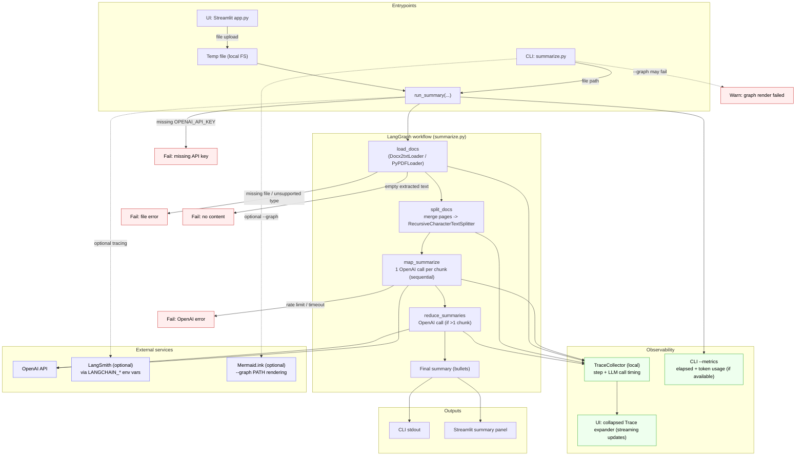

# AI Legal Summarizer — Project Specification

## Executive summary
AI Legal Summarizer is a small demo project that summarizes a `.docx` or `.pdf` contract into a concise bullet list using OpenAI models via LangChain, orchestrated by a simple LangGraph workflow.

It is intended for quick demonstrations (CLI or Streamlit UI) rather than production-grade legal analysis.

## Scope

### Goals
- Accept a single `.pdf` or `.docx` file and produce a bullet summary.
- Provide a CLI (`summarize.py`) and a minimal Streamlit UI (`app.py`).
- Provide basic observability:
  - local “trace” (step + LLM call timing) in the UI
  - optional token usage + elapsed time in the CLI
  - optional LangSmith tracing via environment variables

### Non-goals
- No legal advice, clause redlining, or contract negotiation guidance.
- No long-term storage, indexing, RAG, or knowledge base.
- No authentication/authorization (single-user local demo).
- No background processing/queues; everything runs synchronously.
- No OCR for scanned PDFs (text extraction only).

### Key use-cases
- Demo: “Upload a contract and get a readable summary.”
- Debug: inspect extracted text and intermediate chunk summaries.
- Performance diagnosis: see number of chunks/calls and timing.

## Functional requirements (testable)
- The system SHALL accept an input file path from the CLI and summarize it.
- The system SHALL accept a file upload in Streamlit UI and summarize it.
- The system SHALL support `.pdf` and `.docx` inputs; other types SHALL be rejected with an error.
- The system SHALL require `OPENAI_API_KEY` to be set (via environment or `.env`).
- The system SHALL chunk the extracted text with overlap and summarize each chunk, then reduce to a final summary.
- The system SHALL output the final summary:
  - CLI: printed to stdout
  - UI: rendered in the page
- The system SHOULD optionally expose:
  - extracted raw text (`--raw-text`)
  - intermediate chunk summaries (`--show-chunks`)
  - timing + token usage (`--metrics`)
  - a workflow diagram PNG (`--graph PATH`)
- The Streamlit UI SHALL show a collapsed “Trace” section and stream step progress updates while the run is executing.

## Non-functional requirements

### Reliability
- Fail fast on missing input file, unsupported extension, missing API key, or empty extracted text.
- No automatic retries are currently implemented (known gap).

### Performance / latency
- Latency is dominated by OpenAI API calls. The number of calls is approximately:
  - `N_chunks` (map step) + 1 (reduce step, when `N_chunks > 1`)
- Chunking parameters directly affect call count and latency:
  - larger `chunk_size` → fewer chunks → fewer calls → lower latency
  - overlap increases input size and can increase latency/cost

### Scalability / availability
- Designed for single-user local execution only.
- Availability depends on OpenAI availability and network connectivity.

### Privacy / security
- Contract contents are sent to OpenAI (external service). Do not use with sensitive data unless this is acceptable.
- API keys live in `.env` and must not be committed.
- Optional LangSmith tracing may transmit prompts/metadata to LangSmith depending on configuration.

### Cost
- Cost scales with total tokens sent/received to/from OpenAI and number of calls.
- Token usage can be observed via `--metrics` (when the provider reports it).

## System boundaries

### Inside the system
- CLI entrypoint: `summarize.py`
- Streamlit UI: `app.py`
- LangGraph workflow: load → split → map summarize → reduce
- Local trace collection: `TraceCollector`
- Optional diagram rendering: `--graph` uses LangGraph’s mermaid rendering helper

### Outside the system (external dependencies)
- OpenAI API (LLM inference)
- LangSmith (optional tracing backend)
- Mermaid.ink (used by default by `draw_mermaid_png()` to render the graph PNG; optional/fragile in restricted-network environments)

## User roles / actors
- Demo user (local): runs CLI or opens Streamlit UI, provides a document, reads the summary.
- Developer: modifies prompts, chunking, UI, or observability.

## Data

### Inputs
- A single `.pdf` or `.docx` file (local path or uploaded via UI).

### Outputs
- Final summary text (bulleted).
- Optional:
  - extracted raw text (per source “Document”)
  - intermediate chunk summaries
  - local trace events (in-memory)
  - workflow PNG written to disk (if requested)

### Retention and storage
- UI writes the uploaded file to a temporary file and deletes it after processing.
- No database or persistent storage is used.
- Any saved artifacts (e.g., `workflow.png`) are stored on local disk.

### Sensitivity classification (inferred)
- Inputs may contain confidential or personal data (contracts often do).
- Treat input as “confidential” by default unless you know otherwise.

## Error handling & edge cases
- Missing input path → error (CLI prompts interactively if no args are provided).
- Missing/invalid file path → `FileNotFoundError`.
- Unsupported file extension → `ValueError`.
- PDF with no extractable text (scanned) → “No content loaded” error.
- OpenAI errors (timeouts/rate limits/network) → surfaced to the user; no retry/backoff currently.
- Graph PNG rendering may fail due to restricted network (Mermaid.ink); summary still runs.

## Configuration & secrets

### Config files
- `.env.example` documents required/optional environment variables.
- `.env` is local-only; contains secrets; do not commit.

### Required environment variables
- `OPENAI_API_KEY`

### Optional environment variables
- `OPENAI_MODEL` (defaults to `gpt-4o-mini` in code)
- LangSmith (optional):
  - `LANGCHAIN_TRACING_V2` (`true`/`false`)
  - `LANGCHAIN_API_KEY`
  - `LANGCHAIN_PROJECT`
  - `LANGCHAIN_ENDPOINT`

## Local development

### Prerequisites
- Python installed (this project has been used with Python 3.12.x in this session).
- Network connectivity to OpenAI (and optionally LangSmith).

### Setup
```bash
python -m venv .venv
source .venv/bin/activate
python -m pip install -U pip
python -m pip install -r requirements.txt
```

### Common commands
- CLI:
  - `python summarize.py "Software License Agreement.docx"`
  - `python summarize.py "Synthetic_SaaS_Software_License_Agreement_CZ_Law_FINAL.pdf" --metrics`
- UI:
  - `streamlit run app.py`

## Testing strategy
- No automated tests are currently present (known gap).
- Recommended next steps:
  - Unit tests for text splitting and trace event emission.
  - Integration test that runs `run_summary()` against a small fixture using a mocked LLM response.

## Deployment
- No deployment pipeline or CI/CD is included.
- Current intended deployment is local execution (CLI) or local Streamlit server.

## Observability
- Local trace:
  - `TraceCollector` records step durations and LLM call durations.
  - Streamlit UI shows a collapsed Trace section and streams updates during execution.
- Metrics:
  - CLI `--metrics` prints elapsed time and token usage (if reported).
- Tracing:
  - LangSmith can be enabled via environment variables.

## Security considerations
- Least privilege: keep API keys in `.env`; avoid sharing `.env`.
- Data exfiltration risk: contract text is sent to OpenAI; optional traces may be sent to LangSmith.
- Dependency risk: dependencies are not pinned; consider pinning versions for reproducibility.

## Known gaps / TODOs / risks
- No retries/backoff for OpenAI rate limits/timeouts.
- No OCR/scanned-PDF support.
- Chunk summarization is sequential; map calls are not parallelized.
- No automated tests or CI.
- Graph PNG rendering may fail in restricted-network environments (Mermaid.ink dependency).

## End-to-end workflow

